# Intro

The `@PLUGIN@` plugin provides support for
[code owners](user-guide.html#codeOwners) in Gerrit.

If the `@PLUGIN@` plugin is enabled, changes can only be submitted if all
touched files are covered by [approvals](user-guide.html#codeOwnerApproval) from
code owners.

The features of the `@PLUGIN@` plugin are described [here](feature-set.html).

**NOTE:** The `@PLUGIN@` is replacing the `find-owners` plugin. For projects that
used code owners with the `find-owners` plugin before, the existing `OWNERS`
files continue to work and the only major difference is that the `@PLUGIN@`
plugin comes with a new UI for selecting code owners and showing the code owner
status.

This document focuses on the workflows in the UI. Further information can be
found in the [user guide](user-guide.html).

## <a id="enableThePlugin">Enable the plugin

As a user you don’t need to do anything as the plugin is enabled by the host
administrator.

**NOTE:** As host administrator please follow the instructions in the [setup
guide](setup-guide.html).

## <a id="reportBug">Bug report / Feedback

Please report bugs or send feedback using this [Monorail
template](https://bugs.chromium.org/p/gerrit/issues/entry?template=code-owners-plugin).

You can also report bugs through the bug icon in the reply dialog next to the
`HIDE OWNERS` / `SUGGEST OWNERS` button.

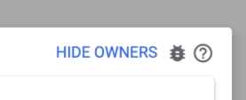

## <a id="howDoesItWork">How does the @PLUGIN@ plugin work?

The `@PLUGIN@` plugin provides suggestions of code owners for files that you are
modifying in your change, so that you can easily add them as reviewers, as
you'll need their approval to submit your change.

For each file (or group of files that share the same code owners) you get the 5
best suitable code owners suggested. Which code owners are best suitable to
review a file is computed based on multiple [scoring
factors](rest-api.html#scoringFactors), e.g. the distance of the code owner
config file that defines the code owner to the path for which code owners are
listed (the lower the distance the better the code owner). If wanted the code
owner suggestion can be expanded to all code owners.

The `@PLUGIN@` plugin also informs you at a glance about the status of the code
owners approvals for the change and the status of code owner approvals per file.

## <a id="addCodeOwnersAsReviewers">Add code owners to your change

1. To add code owners for the files in your change, click on `SUGGEST OWNERS` or
   `ADD OWNERS` next to the `Code Owners` submit requirement.

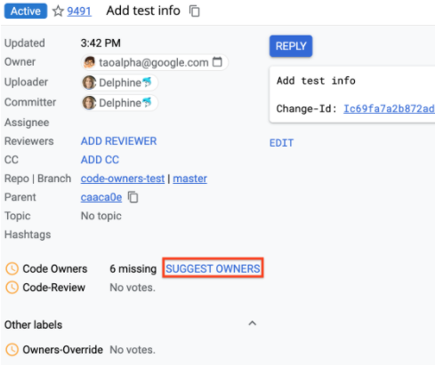

2. The Reply dialog opens with the code owners section expanded that shows the
   code owners suggestions. Code owners are suggested by groups of files which
   share the same code owners.

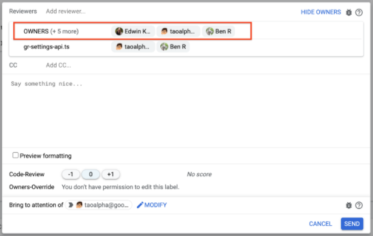

3. Hover over a file group to view the list of files and their full file paths.

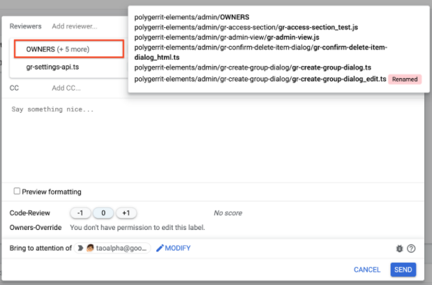

4. Click on user chips to select a code owner for each file or file group.
   The selected code owner is automatically added to the reviewers section and
   automatically selected on other files / file groups that this code owner owns
   (if applicable).

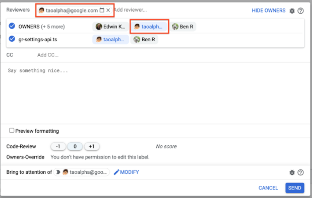

5. Click `SEND` to notify the code owners you selected on your change.

## <a id="replyDialogUseCases">Reply dialog use cases

### <a id="noCodeOwnersFound">No code owners found

There are several possible reasons for encountering a "Not found" text:

- No code owners were defined for these files.
  Reason: This could be due to missing `OWNERS` files that cover these files.

- None of the code owners of these files are visible.
  Reason: The code owners accounts are not visible to you.

- None of the code owners can see the change.
  Reason: The code owners have no read permission on the target branch of the
  change and hence cannot approve the change.

- Code owners defined for these files are invalid.
  Reason: The emails cannot be resolved.

For these cases, we advise you to:

1. Ask someone with override powers (e.g. sheriff) to grant a [code owner
   override](#applyingCodeOwnerOverride) vote to unblock the change submission.
2. Contact the project owner to ask them to fix the code owner definitions, or
   permissions if needed.

### <a id="renamedFiles">Renamed files

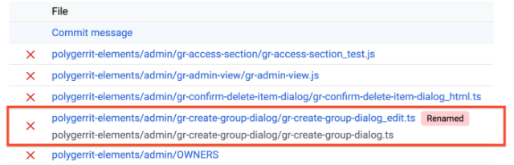

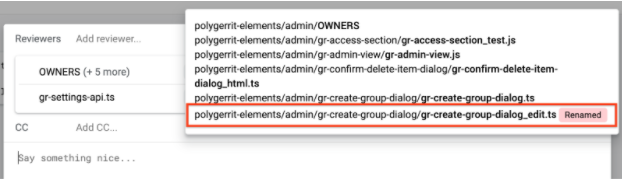

Renamed files (new path) will have a "Renamed" chip attached to them. A renamed
file will be considered as approved only if both old path/name and new path/name
are approved.

### <a id="failedToFetch">Failed to fetch file

This status is informing you about a failed API call.
**Refresh the page** to recover from this error.

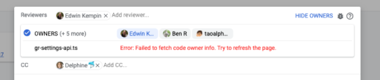

### <a id="largeChange">Large change

If a change contains a large number of files (hundreds or even thousands), it
will take some time to fetch all suggested code owners. In this case the reply
dialog will show the overall status of fetching code owners and display results
as soon as they come in. Files for which the suggestions are still being
computed have a loading indicator that will disappear as soon as the suggestions
are available.

Fetching code owner suggestions does not block the reply itself. So you can
select code owners from suggestions that are already available, while
suggestions for other files are still being fetched. Sending the reply is
possible even when suggestions for some files are still being fetched.

**NOTE:** If retrieving suggestions fails for some files, these files will show
up as a single group.

## <a id="codeOwnerStatus">Code owner status on change page

In the change page, you can get an overview of the code owner statuses.

If applicable, the code owner status is displayed:

- Next to the `Code Owners` submit requirement

- Next to each file

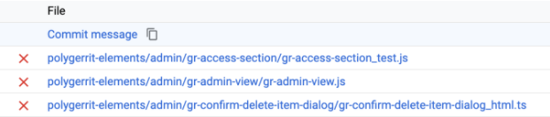

### <a id="codeOwnersSubmitRequirement">`Code Owners` submit requirement

The `Code Owners` submit requirement is providing an overview about the code
owner status at a glance.

- Missing a reviewer that can grant the code owner approval
- Pending code owner approval
- Approved by a code owner

**Missing code owner approval**

The change is missing a reviewer that can grant the code owner approval.

**Pending code owner approval**

- The change is pending a vote from a reviewer that can grant the code owner
  approval. Code owners have been added to the change but have not voted yet.

- A code owner has voted -1 on the change. A -1 doesn't block a file from being
  approved by another code owner. The status is pending because the change needs
  another round of review.

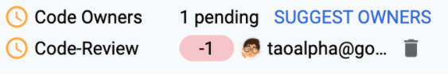

**Approved by code owner**

Each file in your change was approved by at least one code owner. It's not
required that all code owners approve a change.

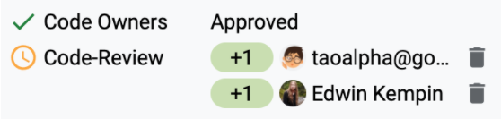

### <a id="perFilCodeOwnerStatuses">Per file code owner statuses

The `@PLUGIN@` plugin also shows the code owner statuses per file in the file
list.

For each file the code owner status is shown as an icon. You can **hover over
the icon** to get additional information displayed a tooltip.

**Missing code owner approval**

A code owner for this file is missing as a reviewer.

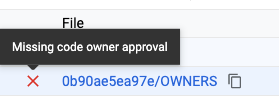

**Pending code owner approval**

A code owner for this file has been added to the change but has not voted yet.

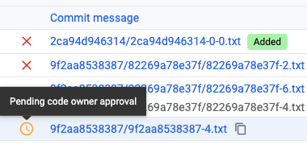

**Approved by code owner**

A code owner of this file has approved the change. You can also see this icon if
you are a code owner of the file as in this case the file is implicitly approved
by you, or if the change has been exempted from requiring code owner approvals.

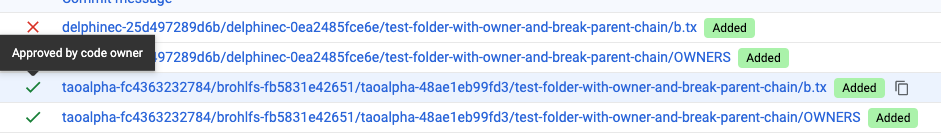

**Failed to fetch status icon**

This status is informing you about a failed API call.
**Refresh the page** to recover from this error.

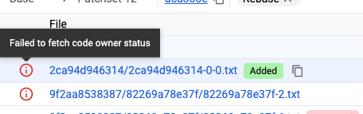

### <a id="noStatus">No label and no status

When you own all the files in your change, the `@PLUGIN@` plugin will:

- Not show the `Code-Owners` submit requirement
- Not show the file status

## <a id="applyingCodeOwnerOverride">Applying a code owner override

Users with certain permissions (e.g. sheriffs) can bypass the `Code Owners`
submit requirement by applying a [code owner
override](user-guide.html#codeOwnerOverride) approval (usually a
`Owners-Override+1` vote).

The code owner override approval is applied by voting on the override label in
the reply dialog, the same way as voting on any other label is done. Voting on
the override label is only offered to users that have permissions to vote on
this label.

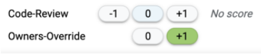

If a code owner override approval has been applied, the `Code Owners` submit
requirement returns the status `Approved (Owners-Override)`.

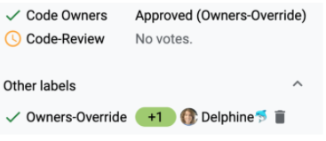

## <a id="definingCodeOwners">Defining code owners

Code owners are defined in [code owner config
files](user-guide.html#codeOwnerConfigFiles) (e.g.
[OWNERS](backend-find-owners.html#syntax) files) that are stored in the source
tree of the repository.

**NOTE:** If you have used code owners via the `find-owners` plugin before, code
owners are already defined in `OWNERS` files and you don’t need to do anything
since the `@PLUGIN@` plugin just reads the existing `OWNERS` files.

**NOTE:** The `@PLUGIN@` plugin does not support an editor to create and edit
`OWNERS` files from the UI. This means `OWNERS` files must be created and edited
manually in the local repository and then be pushed to the remote repository,
the same way as any other source file.

---

Back to [@PLUGIN@ documentation index](index.html)

Part of [Gerrit Code Review](../../../Documentation/index.html)
